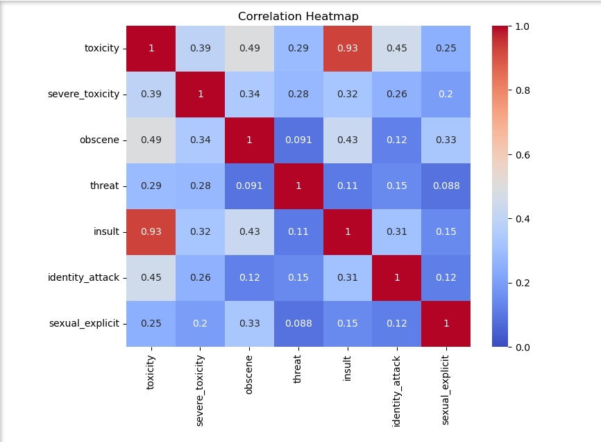
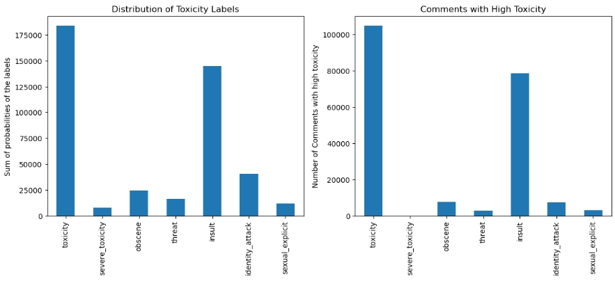

# CSE151A Final Report
##### Pranshu Gupta, Shashwat Dudeja, Charlie Ngo
___
## Introduction
One of the best aspects of social media and online platforms is the ability for users to communicate and interact. However, this aspect comes with a problem with managing __toxic and harmful language__. Most platforms such as Instagram, Tiktok, and popular online videogames use an automatic profanity filter that blocks certain words. Although these filters can block explicit language they __fail to detect statements that have implied or subtle toxicity__. 

This issue is prelavant games such as _Marvel Rivals_ or _Overwatch_, where players often make harmful statements that bypass profanity filters. This encourages toxicity and disrupts player community.

For our project, we chose to build a __toxicity classification model__ on [Google's civil comments](https://huggingface.co/datasets/google/civil_comments) dataset. The dataset contains over 1.8 million English statements represented by toxicity values. One application of this project would be to promote healthier online communities and user experience. Another application would be a stronger automatic profanity filter that extends to detecting subtle toxic statements. Our goal of this project is to accurately predict if a comment is toxic or not given a statement using the civil comments dataset. 
___
## Methods

We followed the standard machine learning pipeline.

### Data Exploration

For our exploration we wanted to get an idea of the distribution on all features. The dataset's features were 'text', 'toxicity', 'severe_toxicity', 'obscene', 'threat', 'insult', 'identity_attack', 'sexual_explicit'. We created a histogram to see the distribution. The majority of the statements were labeled with 0.0 which makes the dataset heavily skewed. We chose to drop all features except for 'toxicity' and 'text' since those were the most useful for our training model. In order to create a more balance dataset, we would need to reduce the size of the dataset.  

Figure 1: This histogram describes the distribution of the number of statements that lied in between values of 0 to 1.

Figure 2: This heatmap shows the correlation between all features. 'insult' and 'toxicity' have the highest correlation at 0.93.

### Preprocessing

Our unprocessed data was relatively clean, with zero NaN values and 24,051 duplicate values. We removed the duplicates values incase they lead to future issues. 

For preprocessing, we created a new categorical feature called _toxic_ that has binary values. A comment is considered to be toxic if: $$\text{toxicity} > 0.5 $$

To address the severe imbalancing of the dataset, we took a subset of 100,000 comments. The subset contained 50,000 toxic = 1 and 50,000 toxic = 0.

We did text cleaning by converting all statements to be lowercase, special characters, and normalize whitespace.

For feature engineering, we used TF-IDF for text vectorization and created additional numerical features such as text length and word count.

We then split the dataset into training and validation sets.

Figure 3: The left histogram shows the sum of all probabilites in each feature. The right histogram shows us comments that have 'toxicity' > 0.5. This demonstrates the skewnessed of the dataset and why we approached our preprocessing steps. 

### Model 1

For our first model, we chose Multinomial Naive Bayes since it is well suited for text classification because of our TF-IDF features. The only parameter for our model was _alpha_ which is a laplace smooting parameter. We evaluated our model creating a confusion matrix and validation classification report. We adjusted parameters by changing the _alpha_ values. We chose our optimal alpha by plotting the F1-score and alpha. 

### Model 2 

For our second model, we implemented a pipeline combining TF-IDF for text vectorization, Truncated SVD for dimensionality reduction, and a Logistic Regression classifier. Hyperparameter tuning was performed  using GridSearchCV to find the optimal number of SVD components and the best regularization parameter (C) for the classifier. This model was evaulated using a confusion matrix and classification report. 