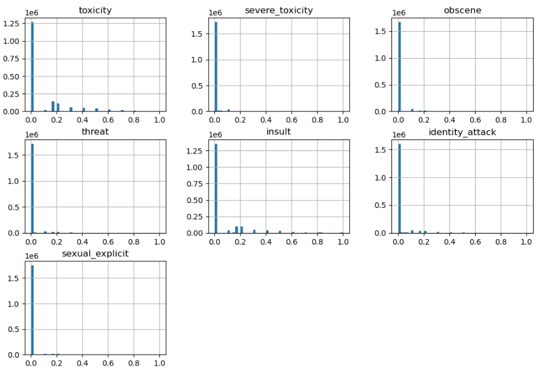
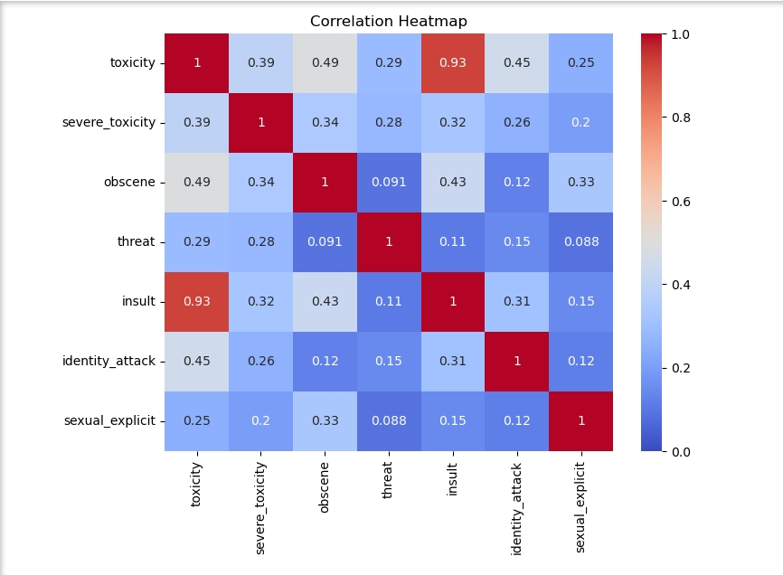
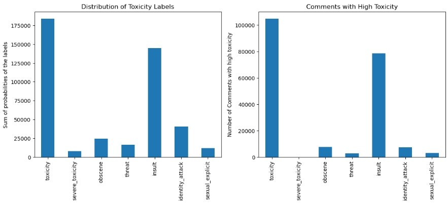
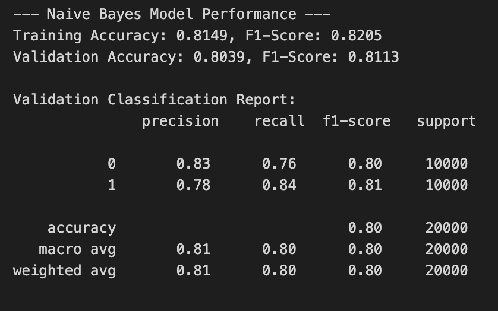
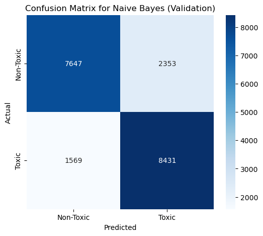
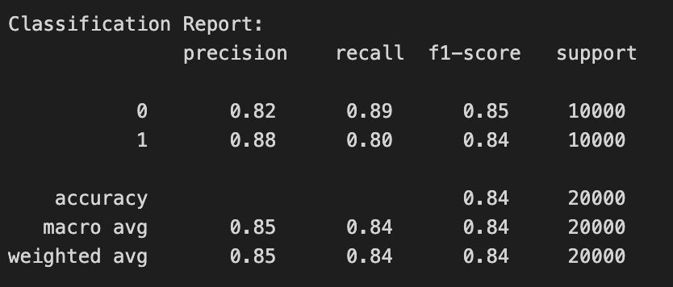
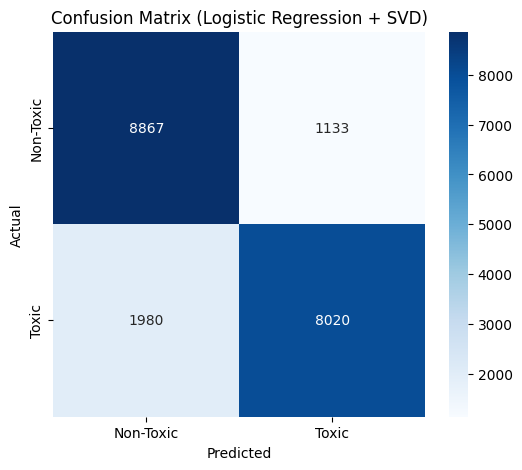

# CSE151A-Project
Classification Model for CSE151A Summer Session 2. 

### Link to dataset: [civil_comments](https://huggingface.co/datasets/google/civil_comments)
### Link to milestones: [milestones](https://github.com/c4ngo/CSE151A-Project/blob/main/milestones.md)

The setup environment for this project is the following:

- __Python 3.9__
- __numpy__
- __matplotlib__
- __seaborn__
- __scikit-learn__
- __datasets__
  
The virtual environment used is __Jupyter__


# CSE151A Final Report
##### Pranshu Gupta, Shashwat Dudeja, Charlie Ngo
___
## Introduction
One of the best aspects of social media and online platforms is the ability for users to communicate and interact. However, this aspect comes with a problem with managing __toxic and harmful language__. Most platforms such as Instagram, Tiktok, and popular online videogames use an automatic profanity filter that blocks certain words. Although these filters can block explicit language they __fail to detect statements that have implied or subtle toxicity__. 

This issue is prelavant games such as _Marvel Rivals_ or _Overwatch_, where players often make harmful statements that bypass profanity filters. This encourages toxicity and disrupts player community.

For our project, we chose to build a __toxicity classification model__ on [Google's civil comments](https://huggingface.co/datasets/google/civil_comments) dataset. The dataset contains over 1.8 million English statements represented by toxicity values. One application of this project would be to promote healthier online communities and user experience. Another application would be a stronger automatic profanity filter that extends to detecting subtle toxic statements. Our goal of this project is to accurately predict if a comment is toxic or not given a statement using the civil comments dataset. 
___
## Methods

We followed the standard machine learning pipeline.

### Data Exploration

For our exploration we wanted to get an idea of the distribution on all features. The dataset's features were 'text', 'toxicity', 'severe_toxicity', 'obscene', 'threat', 'insult', 'identity_attack', 'sexual_explicit'. We created a histogram to see the distribution. The majority of the statements were labeled with 0.0 which makes the dataset heavily skewed. We chose to drop all features except for 'toxicity' and 'text' since those were the most useful for our training model. In order to create a more balance dataset, we would need to reduce the size of the dataset.  



Figure 1: This histogram describes the distribution of the number of statements that lied in between values of 0 to 1.



Figure 2: This heatmap shows the correlation between all features. 'insult' and 'toxicity' have the highest correlation at 0.93.

### Preprocessing

Our unprocessed data was relatively clean, with zero NaN values and 24,051 duplicate values. We removed the duplicates values incase they lead to future issues. 

For preprocessing, we created a new categorical feature called _toxic_ that has binary values. A comment is considered to be toxic if: $$\text{toxicity} > 0.5 $$

To address the severe imbalancing of the dataset, we took a subset of 100,000 comments. The subset contained 50,000 toxic = 1 and 50,000 toxic = 0.

We did text cleaning by converting all statements to be lowercase, special characters, and normalize whitespace.

For feature engineering, we used TF-IDF for text vectorization and created additional numerical features such as text length and word count.

We then split the dataset into training and validation sets.



Figure 3: The left histogram shows the sum of all probabilites in each feature. The right histogram shows us comments that have 'toxicity' > 0.5. This demonstrates the skewnessed of the dataset and why we approached our preprocessing steps. 

### Model 1

For our first model, we chose Multinomial Naive Bayes since it is well suited for text classification because of our TF-IDF features. The only parameter for our model was _alpha_ which is a laplace smooting parameter. We evaluated our model creating a confusion matrix and validation classification report. We adjusted parameters by changing the _alpha_ values. We chose our optimal alpha by plotting the F1-score and alpha. 

### Model 2 

For our second model, we implemented a pipeline combining TF-IDF for text vectorization, Truncated SVD for dimensionality reduction, and a Logistic Regression classifier. Hyperparameter tuning was performed  using GridSearchCV to find the optimal number of SVD components and the best regularization parameter (C) for the classifier. This model was evaulated using a confusion matrix and classification report. 
___
## Results

### Data Exploration

### Preprocessing

- For the preprocessing, we had decided to first drop all columns to create a binary target column called 'Toxic' which would be 1 if the 'toxicity_score' for a comment was > 0.5 and 0 otherwise. 

```
target_columns = ['toxicity', 'severe_toxicity', 'obscene', 'threat', 'insult', 'identity_attack', 'sexual_explicit']
df_train['toxic'] = (df_train[target_columns] > 0.5).any(axis=1).astype(int)
```

- Then, we had decided to deal with the imbalance in the dataset by taking a subset of 100,000 comments with 50,000 toxic and 50,000 non-toxic comments

```
toxic_comments = df_train[df_train['toxic'] == 1]
non_toxic_comments = df_train[df_train['toxic'] == 0]

# Create a balanced dataset
non_toxic_sampled = non_toxic_comments.sample(n=50000, random_state=42)
toxic_sampled = toxic_comments.sample(n=50000, random_state=42)
df_balanced = pd.concat([toxic_sampled, non_toxic_sampled])
```

- Our next step was cleaning up the text and prepping it for TF-IDF by converting it to lower case, removing special characters and normalizing whitespace

```
# --- Text Preprocessing ---
def clean_text(text):
    text = text.lower()
    text = re.sub(r'[^a-z\s]', '', text)
    text = re.sub(r'\s+', ' ', text).strip()
    return text

df_balanced['cleaned_text'] = df_balanced['text'].apply(clean_text)
df_balanced.dropna(subset=['cleaned_text'], inplace=True)
```

- Then, we split the dataset into training and validation sets and used TF-IDF for text vectorization

```
# --- Train-Validation Split ---
X = df_balanced.drop('toxic', axis=1)
y = df_balanced['toxic']
X_train, X_val, y_train, y_val = train_test_split(X, y, test_size=0.2, random_state=42, stratify=y)

# --- Feature Engineering and Vectorization ---
# TF-IDF for text
tfidf = TfidfVectorizer(max_features=5000, ngram_range=(1, 2), min_df=5, max_df=0.8, stop_words='english')
X_train_text = tfidf.fit_transform(X_train['cleaned_text'])
X_val_text = tfidf.transform(X_val['cleaned_text'])

print("Feature matrix created with shape:", X_train_text.shape)
```
```
Feature matrix created with shape: (80000, 5000)
```

### Model 1
Our first model was a **Multinomial Naive Bayes** algorithm on the TF-IDF features. 

#### Performance:



Figure 4: F1-Score, Precision, Recall and Accuracy of 1st Model on Training and Validation sets

**Training Set:**

<ins>F-1 Score:</ins> 0.8205

<ins>Accuracy:</ins> 81.49%

**Validation Set:**

<ins>Precision:</ins> 0.78

<ins>Recall:</ins> 0.84

<ins>F-1 Score:</ins> 0.8113

<ins>Accuracy:</ins> 80.39%



Figure 5: Confusion Matrix for 1st Model

*   **Correct Predictions: 16,078**
    *   **True Positives (Correctly identified as toxic)**: 8,431
    *   **True Negatives (Correctly identified as non-toxic)**: 7,647
*   **Incorrect Predictions: 3,912**
    *   **False Positives (Incorrectly identified as toxic)**: 2,343
    *   **False Negatives (Incorrectly identified as non-toxic)**: 1,569

### Model 2
For our second model, we performed **Truncated SVD** on the TF-IDF features and made a **Logistic Regression** model.

#### Performance: 



Figure 6: F1-Score, Precision, Recall and Accuracy of 2nd Model on Training and Validation sets

**Training Set:**

<ins>F-1 Score:</ins> 0.8407

<ins>Accuracy:</ins> 84.83%

**Validation Set:**

<ins>F-1 Score:</ins> 0.8375

<ins>Accuracy:</ins> 84.44%



Figure 7: Confusion. Matrix for 2nd Model

*   **Correct Predictions: 16,887**
    *   **True Positives (Correctly identified as toxic)**: 8,020
    *   **True Negatives (Correctly identified as non-toxic)**: 8,867
*   **Incorrect Predictions: 3,113**
    *   **False Positives (Incorrectly identified as toxic)**: 1,133
    *   **False Negatives (Incorrectly identified as non-toxic)**: 1,980
___
## Discussion

### Data Exploration
During the data exploration step, we were still discussing what our project should exactly aim to do. Whether it should be a multiclass classification model or whether we should make a new target column.

We also found that the dataset had a lot of imbalance as it was heavily skewed towards non toxic comments.

### Data Preprocessing
Here, we first did the basic steps of checking and dealing with null and duplicate values. 

Then, we took the decision as a group to introduce a binary target column called toxic which our model would predict. As we were dealing with text, we decided to apply TF-IDF features to the text.

We also decided to use a subset of the dataset with a 50:50 split of toxic to non toxic comments to deal with the class imbalance.

### Model 1
We settled on using Multinomial Naive Bayes for our first model as it is commonly used in this kind of application when dealing with text classification with TF-IDF features. It performed fairly well (~80% accuracy) on both the training and validation datasets. 

Our only hyperparameter in this model was the alpha which is used for smoothing out the data when dealing with words with zero prior probabilities. It is relatively less consequential in this model as compared to hyperparameters in other algorithms or models. But with good hyperparameter tuning, it helped optimize our model a little more.

### Model 2
For our second model, we decided to apply Truncated SVD on our data as our unsupervised learning algorithm and use Logistic Regression on the new features. We used hyperparameter tuning using the `GridSearchCV` method to find the optimal number of components from SVD and the best C for regularization in Logistic Regression. We found that the best number of components for SVD was 1000 which was what we thought it would be as text comments can be greatly varying in tone and would require a lot of features. 

Our 2nd model performed a little better than our 1st (~84% to ~80%) which was interesting. It was much better at classifying non toxic comments but slightly worse at classifying toxic comments (We can see this in the confusion matrices of the two models). Multinomial Naive Bayes might have performed a little better at positive classifications as similar words are often used in toxic comments. A curse word or a word like 'hate' would rarely ever be in a non toxic comment and thus, its prior probability helps in better classifying it as toxic. Whereas with non-toxic comments, it might not be as easy to choose specific words that immediately indicate what kind of comment it is. Maybe truncated SVD condensed those patterns or those kinds of words used in non toxic comments into certain features better which allowed it to be better at negative classifications. 

We could further investigate this theory by perhaps looking at what TF-IDF features have the highest prior probabilities in our first model. 
___
## Conclusion

The second model, a Logistic Regression classifier enhanced with Truncated SVD, proved to be highly effective for this text classification task. The grid search identified the optimal hyperparameters as `C=5` for logistic regression and `n_components=1000` for SVD, resulting in a peak cross-validated F1-score of **83.08%**.

The final model achieved a **validation accuracy of 84.44% and an F1-score of 83.75%**. An analysis of the confusion matrix reveals that the model correctly identified 8,020 toxic and 8,867 non-toxic comments, showing a strong ability to distinguish between the two classes.

**Potential Improvements:**
*   **Advanced Feature Engineering**: Using more sophisticated text representations like Word2Vec or GloVe embeddings could help the model better grasp semantic context and nuances in language.
*   **Exploring More Complex Models**: To potentially capture more complex, non-linear patterns, we could train advanced models like Support Vector Machines (SVM) or gradient-boosted trees (e.g., XGBoost).
*   **Training on More Data**: While trained on a balanced 100,000-comment dataset, increasing the size of this balanced set could further improve the model's robustness and generalization capabilities.

#### Next Steps: Future Models

Based on the project's progress, the next logical models to explore are:

1.  **Support Vector Classifier (SVC)**: SVCs excel in high-dimensional feature spaces like the ones created by TF-IDF. They are powerful because they can find the optimal hyperplane that separates classes, allowing them to model complex decision boundaries effectively. This makes them a strong candidate for potentially outperforming Logistic Regression.

2.  **Decision Trees and Ensemble Models**: While individual decision trees can be prone to overfitting, they are the building blocks for highly effective ensemble methods like **Random Forests** or **Gradient Boosting Machines (e.g., XGBoost, LightGBM)**. These models are industry standards for classification tasks because they can capture non-linear relationships and feature interactions, often leading to state-of-the-art performance.
___
## Statements of Collaboration

### Charlie Ngo:
For Milestone 1, I created the abstract and finding the dataset to use. For Milestone 2, I contributed to the data exploration such as the null and duplicate values. I also generated some plots. For Milestone 3, I discussed which model to use for our Model 1 and made the write-up for the read-me. For Milestone 4, I created our second model and contributed to the Final Report up to the Model section.
### Shashwat Dudeja:
I worked on the write-up for Milestone 4. Discussed with the group about the direction of our project and our decisions over choice of model. Gave feedback and looked over write-ups for Milestone 3 and helped in writing README for Milestone 2. Also helped in coding Data Exploration section and added few markdown sections in the notebook.

### Pranshu Gupta:


